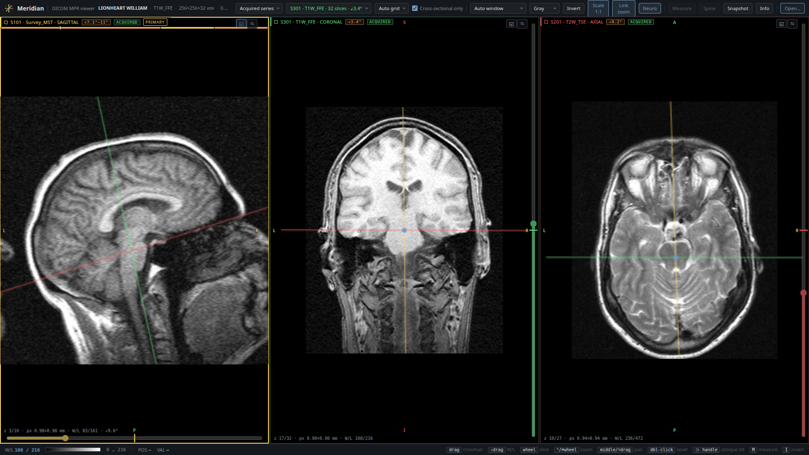

# Meridian

**A local-first DICOM imaging workstation for study review, MPR, 3D, series management, and research notes.**


> [!WARNING]
> **For research and education only — not a medical device.** Not cleared or
> certified for clinical or diagnostic use. See [Disclaimer](#disclaimer).



Open [index.html](index.html) to enter the Meridian workstation. Its routed
Overview, Viewer, Series, and Notes workspaces stay inside one portable offline
HTML app. Drop a study folder to get linked axial / coronal / sagittal MPR views
plus a WebGL2 raycast 3D volume. No upload and no network — everything runs in
the tab.

## Quick start

1. Clone or download this repo (keep `lib/` next to `index.html`).
2. Open `index.html` in a modern browser (WebGL2 required for the 3D view).
3. From **Overview**, drop a DICOM study folder onto the window or use
   **Choose study folder** / **Select DICOM files**.

You bring your own DICOM data — none ships with the repo (see
[Test data](#test-data)).

If folder picking misbehaves over `file://`, serve it locally instead:

```bash
python3 -m http.server 8137 --bind 127.0.0.1
# then open http://127.0.0.1:8137/
```

## Features

- **Four routed workspaces** — a session overview, focused workstation-style
  viewer, searchable series inventory, and exportable in-memory research notes.
  Direct links such as `#viewer` and `#series` restore the intended workspace.
- **Series manager** — filter by description, modality, or series number; inspect
  geometry and transfer syntax; launch any series directly into the viewer.
- **Two layouts** — *MPR + 3D* (linked crosshair through one series) and
  *Acquired series* (every series in its native plane, full resolution).
  Cells auto-pack by aspect ratio, or switch to fixed PACS-style grids (1×1–4×4).
- **Patient-space linking** — click any point in any series and every other
  series jumps to it, with true localizer lines (angled acquisitions show as
  tilted lines, like scanner scouts).
- **Honest reformats** — each view is tagged **ACQUIRED**, **REFORMAT**, or
  **RENDERED**, and shows its effective pixel size, so lower through-plane
  resolution is always visible. Oblique stacks get an angle badge.
- **3D volume** — MIP, depth-colored MIP, or gradient-shaded composite, with
  crosshair-linked slice outlines and clipping.
- **Tools** — window/level (drag or presets), mm distance measure, probe
  readout, colormaps (Gray / Inferno), invert, L/R mirror, PNG snapshot.

## Supported DICOM

- **Transfer syntaxes:** uncompressed (implicit/explicit VR LE, explicit VR BE),
  RLE Lossless, JPEG Lossless (P14 & SV1), JPEG-LS, JPEG 2000, and 8-bit JPEG
  baseline. Unsupported syntaxes are reported clearly.
- **Pixel formats:** 8/16-bit monochrome (signed/unsigned) and color (RGB,
  YBR_FULL / _422, planar or interleaved).
- **Multiframe:** classic and enhanced MR/CT with per-frame geometry.

## Controls

| Action | How |
|---|---|
| Move linked crosshair | click / drag on any slice (MPR layout) |
| Scroll slices | wheel, slider, or `↑`/`↓` (`PgUp`/`PgDn` = ±5) on hovered view |
| Window / level | shift-drag on any slice, or header presets |
| Probe | hover any slice — voxel position and value in the status bar |
| Measure distance (mm) | `M`, then drag; double-click a view to clear |
| Invert · Colormap · Mirror | `I` / header selectors / per-view ⇋ |
| Snapshot | save all four views as PNG |
| 3D | drag to rotate, wheel to zoom; buttons for render mode, slice outlines, clip |

An **Info** button opens patient / study / series / slicing details (thickness,
claimed vs. measured spacing, obliquity, live slice position and angle).

## Test data

No sample data ships with this repo. Bring your own study, or grab a public,
de-identified dataset:

- [The Cancer Imaging Archive (TCIA)](https://www.cancerimagingarchive.net/) — large CT/MR/PET collections
- [dclunie's samples](https://www.dclunie.com/images.html) — broad set of transfer syntaxes
- [Rubo Medical samples](https://www.rubomedical.com/dicom_files/) — small, easy first files
- [OsiriX DICOM library](https://www.osirix-viewer.com/resources/dicom-image-library/) — anatomical studies

## Disclaimer

Provided for **research and educational purposes only**. **Not a medical
device**; not cleared or certified by any regulatory body; must **not** be used
for clinical diagnosis, treatment, or any medical purpose. You are responsible
for complying with all applicable privacy laws (HIPAA / GDPR) when handling
DICOM data. Provided "as is", without warranty — see [LICENSE](LICENSE).

## License

[MIT](LICENSE) © Laurent Vandenaweele. Vendored libraries under `lib/` keep
their own licenses — see [THIRD_PARTY_NOTICES.md](THIRD_PARTY_NOTICES.md).
